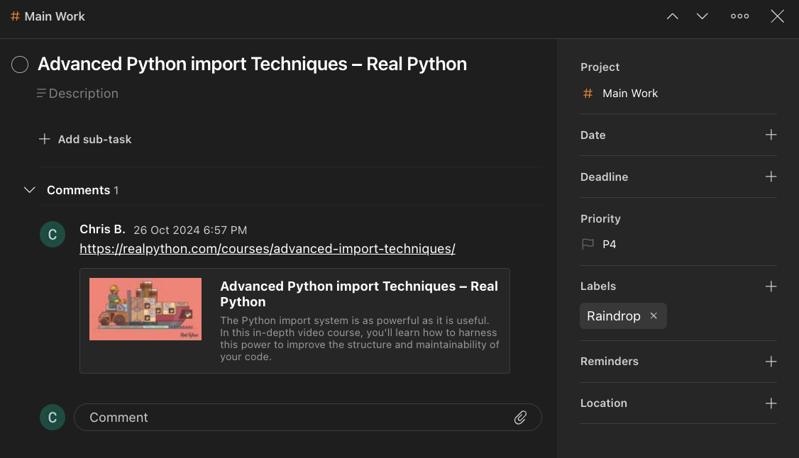

# Raindrop Todoist Syncer

Convert favourited Raindrop bookmarks into Todoist tasks

> [!CAUTION]
> This was a learning project. I still use it - it works - but the code is uggggly

## Features

- Create Todoist tasks from favorited Raindrop bookmarks
- Option to run automatically in the background (on Mac only) via macOS launchd

### My usage

- Turn browser windows into todos.
- No more tabs upon tabs of things I won't do.
- Now I have todoist tasks upon tasks I won't do.
- Much more manageable.

### Screenshot


*A Todoist Task created from a favourited Raindrop*

## Getting Started

Follow these instruction to set up and run Raindrop Todoist Syncer.

### Prerequisites

* Python 3.10 or higher
* A Raindrop account with favorited items and
* A Todoist account

Automated fetching of Raindrops is Mac only - it relies on Apples's launchd / plist
files for automation. (Although a simple cron job would do similar).

### Installation

1. Installation with the [*uv*](https://github.com/astral-sh/uv) package manager (or
pipx) is recommended. (To install *uv* see
[here](https://docs.astral.sh/uv/getting-started/installation/))
2. Run
```
uv tool install git+https://github.com/chrisbillows/raindrop-todoist-syncer.git
```
3. Confirm the installation by:
- Run:
```
which rts
```
You should see something like: `/Users/<your_user_name>/.local/bin/rts`
- Run
```
rts --help
```
The Raindrop Todoist Syncer CLI help should appear.

The package now needs to be configured.

### Configure the package - the `.env` file

The package requires the following file:

```
~/.config/rts/.env
```

To create it run this command:

```bash
mkdir -p "$HOME/.config/rts" && touch "$HOME/.config/rts/.env"
```

Open the empty file with the text editor of your choice e.g.

```
open "$HOME/.config/rts/.env" # Open the .env file with TextEdit
```

Add the following to the `.env` file.

#### API Access Tokens

Raindrop Todoist Syncer requires API access to Todoist and Raindrop.io.

This is configured by adding API tokens to the `.env` file.

> [!CAUTION]
> For both applications API access allows view and modification access to your data.
> API tokens should be treated *like passwords* and not shared.
> Raindrop-Todoist-Syncer runs locally on your machine. I have no access to your data;
nothing is shared. But, if in doubt, always CHECK WITH A GROWN-UP! Or Chat GPT.

#### Todoist API

In Todoist, go to "Integrations" and under "Developer" copy your API key.

Save it to the `.env` file as:

```
TODOIST_API_KEY = 'abc123'
```

#### Raindrop API

Use of the Raindrop API requires an Oauth token.

First go to "Settings", "Integrations" and, under "For Developers", select "Create
new app". Save your client ID and client secret to `.env` file as:

```
RAINDROP_CLIENT_ID = 'abc123'
RAINDROP_CLIENT_SECRET = 'def5456'
```

To get the oauth token follow the steps here:

https://developer.raindrop.io/v1/authentication/token

Add the following to your `.env` file.

```
RAINDROP_REFRESH_TOKEN = 'abc123'
RAINDROP_ACCESS_TOKEN = 'def456'
```

### Usage

####  Run

> [!NOTE]
> Before you run Raindrop Todoist Syncer for the first time, check your Raindrop
favourites. They will *ALL* be turned into Todoist tasks.

Run Raindrop Todoist Syncer once with the command:

```
rts
```

or

```
rts run
```

This will turn your Raindrop favourites into Todoist tasks. Subsequent runs will only
convert NEW favourites into Todoist tasks.

#### Automate syncing

Raindrop Todoist Syncer can fetch Raindrops and create tasks automatically by running in
 the background.

To enable this run:

```
rts automate_enable
```

This will install a `.plist` file in `~/Library/LaunchAgents`. This file tells macOS to
run the Raindrop Todoist command in the background every 5 minutes.

> [!WARNING]
> After running `rts automate_enable` you will get a macOS notification:
> `Background Items Added. "rts" is an item that can run in the background. You can
manage this in Login Items & Extensions.`
> If can toggle this permission in ``Login Items & Extensions``.

#### Disable automated syncing

To disable automated sync (and remove the `.plist` file) run:

```
rts automate_disable
```

## Uninstall

You can remove the package via uv with the command

```
uv tool uninstall raindrop-todoist-syncer
```

You can delete all Raindrop Todoist Syncer files with:

```
rm -rf ~/.config/rts
```

All logs and application files are stored in `~/.config/rts`.  No other files or clutter
 are added to your machine.

## Contact

If you want to contact me you can reach me at [christopherbillows@gmail.com](mailto:christopherbillows@gmail.com).

# License

This project is licensed under the terms of the MIT license.
